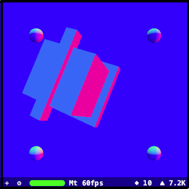
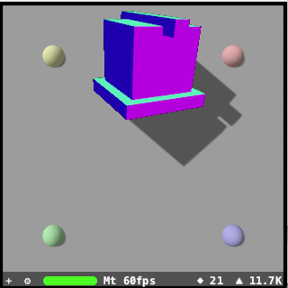
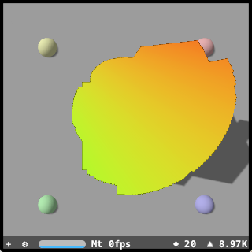
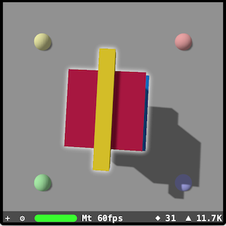

# metal-shader-playground

### Attempt to build a simple Xcode Playground to experiment with Metal shaders

Metal shaders in a playground do work, but are not so useful as we would hope. This is because the shader definition and shader code (`.metal`) have to be added to the _Resources_ in order to work. That means they will not be automatically / live be recompiled. ... At least that doesn't work as smooth as expected.

Another attempt to experiment with Metal shader is to make a simple _cross platform_ (iOS + macOS) app, **MetalBox**, and to run that in debugger mode. It needs to run on a real device, so the development machine on macOS, and an actual iPhone or iPad on iOS, because the iOS Simulator cannot simulate metal.

### MetalBox debugging

The usefulness of the iOS & macOS app, is that you can _Capture the GPU Frame_ while running in debug mode in Xcode.

## Experiments

#### First metal experiment: draw normals as color



Use `draw_normals` technique

#### Draw the normals with a mask



Use `draw_masked_normals` technique

#### Draw the position as color with a mask



Use `draw_masked_position` technique. (See the note about clearing the color state to remove the above artifact)

#### Draw a highlight around a shape



Use `draw_highlight` technique. (The above is with a tap 17 blur and 5 repeated passes)


## TODO

- [ ] The shaders might be optimized by only using one channel image buffers as mask buffers. Right now the mask buffers are default 4 channel (RGBA) color buffers, but only their R (red) channel is used.
  - (Specifically I could not get my fragment functions to output anything else then `half4`. Also the `texture2d<float>` sampler always returned a `float4`, and I could not figure out how to set the fragment arguments'  `MTLPixelFormat`)

## Notes


#### Notes on categoryBitMask:

- categoryBitMasks need to be applied to all the childNodes of compound / combined node. (see example below)
- default categoryBitMask or nodes, lights and techniques is 1
- bitMask of nodes and lights (or technique) are compared with bitwise AND (0 * 1 = 0). Any non-zero result is rendered.

So don't use:

```
object.categoryBitMask = 4
```

But use:

```
object.enumerateChildNodes { (node, stop) in
    node.categoryBitMask = 4
}
```


#### Notes on Clearing of the color state:
 
- There is a difference between the default state of the clear value between iOS and macOS:
    - Default `colorStates.clear` on iOS: `true`
    - Default `colorStates.clear` on macOS: `false`
- Default `depthStates.clear` is `false` on both platforms.
- Clearing means that each draw pass clear the buffer before rendering content to it.
- If you don't clear that means the buffer value could be accumulated
    - This (not clearing) is useful if e.g. you need multiple blur passes on the same buffer.
 
As an example on what happens if you don't clear the color buffer, when you're not drawing every pixel (e.g. when only some nodes are affected from their categoryBitMask)

```
    "colorStates" : {
        "clear" : 0
    },
```
 
 See screenshot `masked_position.png`
 
 
 So, to prevent that, in those cases make sure to set the clear state like so:
 
```
    "colorStates" : {
        "clear" : 1
    },
    "depthStates" : {
        "clear" : 1
    },
```


#### Notes on Optimizing the Blur passes:

- the technique of building an optimized blur shader is well described in this article:
  - http://rastergrid.com/blog/2010/09/efficient-gaussian-blur-with-linear-sampling/
- to study different algorithms and optimizations further, read this one:
  - https://software.intel.com/en-us/blogs/2014/07/15/an-investigation-of-fast-real-time-gpu-based-image-blur-algorithms

To calculate the blur `offsets` and `weights` I used this online tool:

- http://dev.theomader.com/gaussian-kernel-calculator/
  - and _Steve M_'s comment about the potential optimization
- `blurninja` is anohter possible tool to calculate the blur offsets and weights: https://github.com/manuelbua/blur-ninja


#### Notes on making it work Cross Platform:

In order to make the same code compile and run on both macOS and iOS, we need to make some shared type definitions, because the frameworks do not 100% overlap:

##### Colors:

```
#if os(macOS)
    typealias SCNColor = NSColor
#else
    typealias SCNColor = UIColor
#endif
```

##### Floats to be used in a `SCNVector3`:

```
#if os(macOS)
    typealias SCNVectorFloat = CGFloat
#else
    typealias SCNVectorFloat = Float
#endif
```